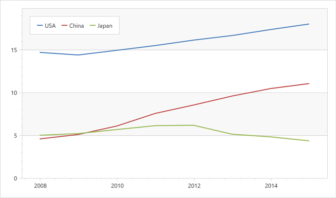

<!-- default badges list -->

<!-- default badges end -->

# Chart for WPF - Use the MVVM Binding Style to Generate Series of an Identical View Type

This example shows how to generate multiple series of the same type from the ViewModel.

To do this, specify the diagram's [SeriesItemsSource](https://docs.devexpress.com/WPF/DevExpress.Xpf.Charts.Diagram.SeriesItemsSource?p=netframework) property that defines a collection of objects used to generate series. To configure how the series view model is converted to a series on a chart, use the [Diagram.SeriesItemTemplate](https://docs.devexpress.com/WPF/DevExpress.Xpf.Charts.Diagram.SeriesItemTemplate?p=netframework) property. In this example, the template is used to generate identical series. Use the [Diagram.SeriesItemTemplateSelector](https://docs.devexpress.com/WPF/DevExpress.Xpf.Charts.Diagram.SeriesItemTemplateSelector?p=netframework) property to create series of various types based on a criterion.

## Files to Look At

* [MainWindow.xaml](./CS/SeriesItemTemplateSample/MainWindow.xaml) (VB: [MainWindow.xaml](./VB/SeriesItemTemplateSample/MainWindow.xaml))
* [ChartViewModel.cs](./CS/SeriesItemTemplateSample/ViewModel/ChartViewModel.cs) (VB: [ChartViewModel.vb](./VB/SeriesItemTemplateSample/ViewModel/ChartViewModel.vb))
* [GdpSeries.cs](./CS/SeriesItemTemplateSample/Model/GdpSeries.cs) (VB: [GdpSeries.vb](./VB/SeriesItemTemplateSample/Model/GdpSeries.vb))

## Documentation

* [How to: Bind Series to View Models Using the Item Template](https://docs.devexpress.com/WPF/118934/controls-and-libraries/charts-suite/chart-control/examples/providing-data/how-to-bind-series-to-view-models-using-the-item-template)
* [Series](https://docs.devexpress.com/WPF/6339/controls-and-libraries/charts-suite/chart-control/series/series)

## More Examples

* [How to Bind a Chart to Its View Model](https://github.com/DevExpress-Examples/how-to-bind-a-chart-to-its-viewmodel-t541777)
* [How to generate Series of different view types using the MVVM binding style](https://github.com/DevExpress-Examples/how-to-generate-series-of-different-view-types-using-the-mvvm-binding-style-t500832)
<!-- feedback -->
## Does this example address your development requirements/objectives?

 

(you will be redirected to DevExpress.com to submit your response)
<!-- feedback end -->
